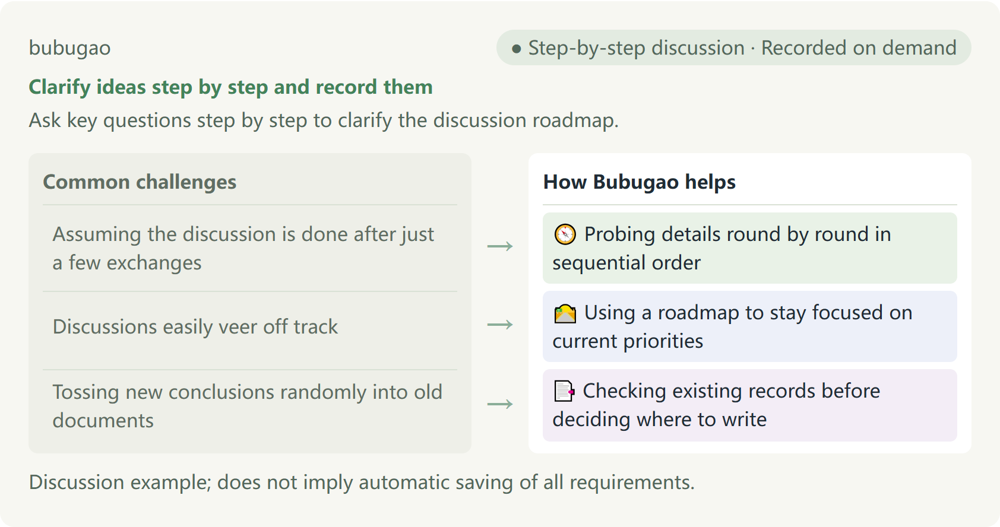

# Bubugao

[English](README.en.md) · [中文](README.md)

**Clarify ideas step by step and record them**

Ask key questions step by step to clarify the discussion roadmap.



- Assuming the discussion is done after just a few exchanges → 🧭 Probing details round by round in sequential order
- Discussions easily veer off track → 🛣️ Using a roadmap to stay focused on current priorities
- Tossing new conclusions randomly into old documents → 📑 Checking existing records before deciding where to write

Discussion example; does not imply automatic saving of all requirements.

## Introduction to Bubugao

Bubugao is built on Matt Pocock's open-source project grill-with-docs. It preserves the core capabilities of the original: asking questions in rounds based on decision dependencies, proactively offering recommendations, verifying existing project facts, clarifying terminology definitions, and recording decisions when conditions are met.

Compared to the original, Bubugao adds only two features: organizing a concise discussion route (Road), and checking whether existing terminology files (Context) are still applicable to the current scenario before writing anything down. It introduces no complex workflows or redundant orchestration frameworks.

- **Dependency-driven probing**: It will not skip ahead to ask minor dependent questions before major prerequisites are settled.
- **Verifying existing records**: When encountering an existing terminology file, it checks whether its content is appropriate for the current discussion, rather than blindly appending new content just because the filename contains Context.

---

## Why We Created Bubugao

When discussing ideas with AI, many people run into a common scenario: after sharing just two or three sentences, the AI responds agreeably, and both sides assume everything is settled. But when it comes time to implement, they realize fundamental concepts were left vague, critical use cases were overlooked, and prerequisite dependencies were never sorted out. At other times, discussions get sidetracked by minor, non-urgent details, losing sight of the main storyline. And once a new conclusion is finally reached, the AI might directly append text to an outdated, unmaintained document where it gets lost forever.

Bubugao is designed to solve these everyday hassles. It asks you questions round by round based on logical dependencies, proactively consulting existing project files when needed to establish facts (or clearly stating what is unknown if permissions are unavailable). Before writing anything down, it verifies whether existing terminology files are still suitable. It also maintains a concise discussion roadmap (Road) that clearly lays out what is already settled, what core questions remain, what to discuss next, and what can be deferred—giving you a clear view of what is decided and what is still missing.

## Daily Usage

Say directly to Codex:

- **Start a discussion**: Use Bubugao to help me clarify this idea.
- **Read-only review**: Use Bubugao to see what's missing in this plan. Just discuss for now without modifying any files.
- **Resume a discussion**: Continue our discussion with Bubugao. First check what remained undecided last time.
- **Pause and checkpoint**: Bubugao, let's pause here for today. Record what's settled and where to pick up next time.

If your environment does not recognize the skill name, you can select it directly from your list of installed skills or type $bubugao to proceed. This skill requires actual file access permissions when writing records to files; if you are only discussing plans in read-only mode, you can proceed directly.

## Let Codex Install It for You

Copy the following text and send it to Codex:

```text
Please first read and follow the installation guide https://github.com/naiman-debug/naiman-skills/blob/main/docs/安装与更新.md . Before copying, check for an existing same-named bubugao skill in both the project skill discovery directory and actual user-level skill discovery locations, and stop immediately if a conflict is found. Copy the complete skills/bubugao from the v0.1.0 release package (including upstream materials and license) into .agents/skills/bubugao in the current practice project, and do not copy the root AGENTS.md. After installation, perform an initial read-only check and report the loaded path and version.
```

## Example: How a Personal Reading List Is Discussed

To illustrate the specific questioning process, here is a fictional discussion example for a personal reading list.

The user previously established two explicit prerequisites: the reading list is stored only on the local computer, and book titles are entered manually. Building on this foundation, Bubugao begins organizing the discussion road: the current goal is to clarify the basic usage of the reading list; the immediate next step is to define reading status values for books; as for the UI color theme mentioned offhand by the user, Bubugao suggests treating it as a deferred item to revisit once the primary logic is clear.

Next, Bubugao presents a concrete use case for the user to decide: "You mentioned three statuses: Want to Read, Reading, and Completed. If you stop reading a book halfway through, should it count as Completed with progress in notes, or should we add a separate 'Abandoned' status? This affects how statistics will be calculated later." Once the user decides to add "Abandoned", Bubugao organizes the term definition in preparation for recording.

- **Respecting established premises**: Builds on the user's confirmed premises of local storage and manual input, without fabricating assumptions or altering them without consent.
- **Offering concrete options for your decision**: Turns vague status transitions into concrete scenario options, leaving the final decision to you.
- **Distinguishing suggested deferrals from confirmed deferrals**: The UI color theme is merely a suggestion from the assistant to defer; it is not treated as a settled decision until the user explicitly confirms it.

## Output Destinations and File Guidelines

Content generated during discussions has designated destinations. Before recording a discussion road (Road), the specific target location is shown in advance. When inspecting terminology files (Context), the corresponding path and suitability assessment are also provided. If ownership or placement is unclear, writes dependent on that placement will pause until confirmed with you. Key architectural decisions are recorded as ADRs only when they meet criteria and with your explicit permission.

- **Dedicated Terminology Files (Context)**: Used to store domain vocabulary and term explanations (such as CONTEXT.md), without any implementation details. If the project contains a domain map file (CONTEXT-MAP.md), it follows the map to locate the terminology file for the relevant domain; if there is no map, it checks the terminology file in the root directory. If the project has none of these files, it does not create empty placeholder files in advance—they are created on demand only when terms are actually finalized.
- **Architecture Decision Records (ADR)**: ADR stands for Architecture Decision Record. Writing an ADR is suggested only when three criteria are met simultaneously: first, the decision is difficult to reverse later; second, future readers will wonder why this choice was made; third, a genuine tradeoff was made among multiple viable alternatives. Routine decisions do not warrant an ADR.
- **Discussion Roadmap (Road)**: Tracks where the discussion currently stands, what remains, and what comes next. When write permission is granted, it prioritizes reusing an already approved location from the current session, writing to ROAD.md in the target project only if no suitable location exists. In read-only mode, the roadmap, unresolved questions upon pausing, and next steps remain solely in the chat response without modifying files.
- **Recording Boundaries**: Routine requirement details are not guaranteed to be fully saved into documents. Completing a discussion does not imply code will be written automatically, nor will it modify or delete any of your other skills.

[Installation and Updates (Chinese)](https://github.com/naiman-debug/naiman-skills/blob/main/docs/安装与更新.md) · [Upstream Pinned Version](https://github.com/mattpocock/skills/tree/3cca18b368ae95cdbdebbff572ccafa662551015) · [Upstream MIT License](https://github.com/naiman-debug/naiman-skills/blob/main/skills/bubugao/LICENSE.upstream)
