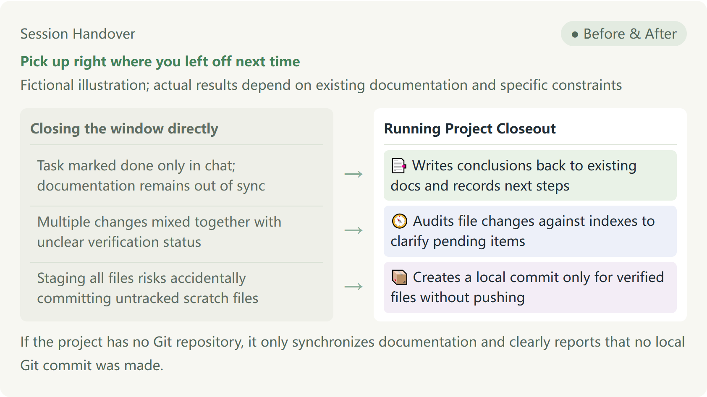

# Project Closeout

[English](README.en.md) · [中文](README.md)

**Pick up right where you left off next time**

Fictional illustration; actual results depend on existing documentation and specific constraints



- Task marked done only in chat; documentation remains out of sync → 📑 Writes conclusions back to existing docs and records next steps
- Multiple changes mixed together with unclear verification status → 🧭 Audits file changes against indexes to clarify pending items
- Staging all files risks accidentally committing untracked scratch files → 📦 Creates a local commit only for verified files without pushing

If the project has no Git repository, it only synchronizes documentation and clearly reports that no local Git commit was made.

## Why Closeout Is Needed

After finishing a feature or organizing materials, chat discussions may be thorough, but project documentation and file indexes often remain out of sync. When resuming work the next day, switching computers, or moving to a different AI assistant, you frequently have to search through changes from scratch and re-explain everything.

Project Closeout reconciles existing progress records, directory indexes, and actual modified files to identify completed and unrecorded work. It writes finished items, unresolved leftovers, and concrete next actions back into existing documentation for seamless continuation at any time.

## Usage Example (Fictional Illustration)

Take a fictional booklist project as an example: you just fixed a title display bug in app.py, but README.md progress notes still reflect the previous stage, and a colleague's draft.txt is left in the workspace.

When you explicitly request a full closeout and all checks pass, it synchronizes the fix progress and next steps in the existing README.md, and creates a local commit containing only the verified app.py and README.md. Standard audits or doc-only updates will not execute a commit, and untouched files like draft.txt left in the workspace remain completely unaffected.

## How to Use in Daily Work

- Use Project Closeout to check today's progress and omissions. Only audit changes against documentation—do not edit files or create commits.
- Use Project Closeout to update existing progress and next steps in the documentation, but do not stage files or make Git commits.
- Use Project Closeout for a full wrap-up: synchronize documentation and make a local Git commit for verified task files, but do not push to remote.

If your assistant does not recognize the English command, enter $project-day-closeout as an explicit fallback.

A full closeout can include a local commit for the current task while strictly respecting existing constraints such as doc-only or no-Git requests; unverified or ambiguously scoped changes will be withheld from the commit with clear reasons given. Documentation updates, Git commits, and business completions are reported separately—a code commit is never treated as business task acceptance.

## Prerequisites and Execution Results

- Full closeout depends on the three-directory skill suite of matching versions. You usually only need to invoke the primary skill; if companion skills are missing, it explains the affected steps without secretly installing them, and will not report full closeout as completed.
- When project rules, directory indexes, or readable materials are incomplete, it continues reconciling using available documentation and current requests while explicitly marking uncovered scopes; restricted partial audits must not be treated as comprehensive gap analysis, nor can they claim full closeout completion.
- When there is no Git repository, documentation handover is still supported, with an explicit report that no local Git commit was made; it will never initialize or configure a repository without authorization.
- During execution, it does not move or delete files on its own initiative, never pushes to remote repositories, and excludes unrelated or unverified staged files.
- After closeout, it reports the exact locations of documentation updates alongside the actual local commit hash or the reason why a commit was omitted.

## Download and Install

```text
Follow the installation guide in https://github.com/naiman-debug/naiman-skills to install Project Day Closeout and its required companions (`skills/project-day-closeout`, `skills/project-directory-closeout`, and `skills/project-git-closeout`) in the current project. If a same-named skill already exists, stop and explain.
```

## Related Resources

[Installation and Update Guide (Chinese)](../../docs/安装与更新.md) · [Skill Specification Details (SKILL.md) (Chinese)](SKILL.md)
