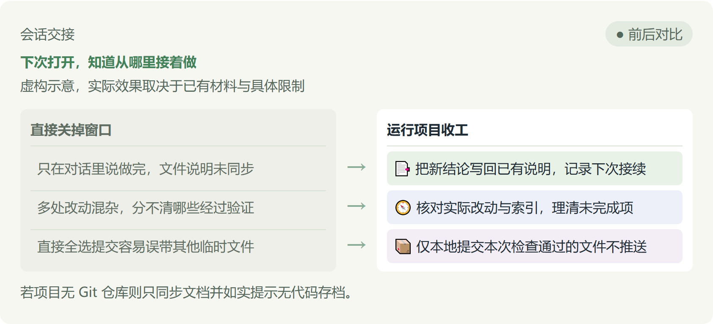

# 项目收工

[English](README.en.md) · [中文](README.md)

**下次打开，知道从哪里接着做**

虚构示意，实际效果取决于已有材料与具体限制



- 只在对话里说做完，文件说明未同步 → 📑 把新结论写回已有说明，记录下次接续
- 多处改动混杂，分不清哪些经过验证 → 🧭 核对实际改动与索引，理清未完成项
- 直接全选提交容易误带其他临时文件 → 📦 仅本地提交本次检查通过的文件不推送

若项目无 Git 仓库则只同步文档并如实提示无代码存档。

## 为什么需要收工

平时做完功能或整理完资料，对话里的讨论虽然完整，但说明文档和文件索引往往还没同步。隔天重新开工、换电脑或换一个 AI 助手时，经常需要从头翻查改动并重新解释。

项目收工在现有进度记录、目录索引和实际文件之间核对，找出改好与未登记的内容，把已完成事项、未决遗留与下一步明确动作写回已有文档，方便随时接续。

## 使用示例（虚构示意）

以虚构的书单项目为例：刚刚在 app.py 修复了标题显示，但 README.md 中的进度依然停留在上一阶段，工作区还放着他人的 draft.txt。

当你明确要求完整收工且各项检查通过后，它会在已有 README.md 中同步修复进展与下一步，并只把本次改好的 app.py 和 README.md 做本地提交。普通检查或只记录时不会执行提交，工作区里其他人留下的 draft.txt 也会原样保留不受影响。

## 日常怎么用

- 使用项目收工先检查今天的进度与遗漏，只核对改动与文档差异，不修改文件也不做提交。
- 使用项目收工更新已有进度与下次接续，把今天的修改记录到文档中，但先不做 Git 提交。
- 使用项目收工打完收工，同步文档后把本次已检查好的文件做本地 Git 提交，不要推送到远程。

若助手未识别中文指令，可输入 $project-day-closeout 兜底调用。

完整收工可以包含本任务的本地提交，但依然遵循只记录、不要Git等已有要求；归属不明或检查未通过的部分会暂缓提交并说明原因。记录更新、Git提交与业务完成会分别报告，绝不把代码提交当成业务验收。

## 使用前提与执行结果

- 完整收工依赖同版本的三目录套件。平时只需调用主技能；若缺少辅助技能会说明受影响步骤且不私下补装，不能报告完整收工已完成。
- 当项目规则、目录索引或可读取资料不完整时，会结合已有说明与当前请求继续核对，但会明确标明未覆盖范围；受限的部分核对不能当作已找全遗漏，也不能宣称已完整收工。
- 无 Git 仓库时依然支持文档接续，但会说明未做 Git 存档，绝不私自初始化或配置仓库。
- 执行时不主动搬移或删除文件，不向远程推送，也不夹带无关暂存项。
- 收工后会汇报文档更新位置，以及实际的本地提交号或未提交原因。

## 下载和安装

```text
请按照 https://github.com/naiman-debug/naiman-skills 的安装指南，将打完收工及其依赖（skills/project-day-closeout、skills/project-directory-closeout、skills/project-git-closeout）安装到当前项目；若已有同名技能，先停止并说明。
```

## English Summary

Project Day Closeout helps developers wrap up a working session by synchronizing progress notes, indexes, and next steps in existing documentation. It provides three operational modes: read-only audit, documentation update, and full local closeout. When full closeout is requested, it creates scoped local Git commits for verified files from the current task without pushing upstream. If dependencies, project rules, or Git permissions are missing, it proceeds with partial updates, clearly lists affected stages, and explains any withheld actions. Documentation updates, Git commits, and business completions remain strictly separated and reported independently.

## 相关资料

[安装与更新指南](../../docs/安装与更新.md) · [技能规范详情（SKILL.md）](SKILL.md)
