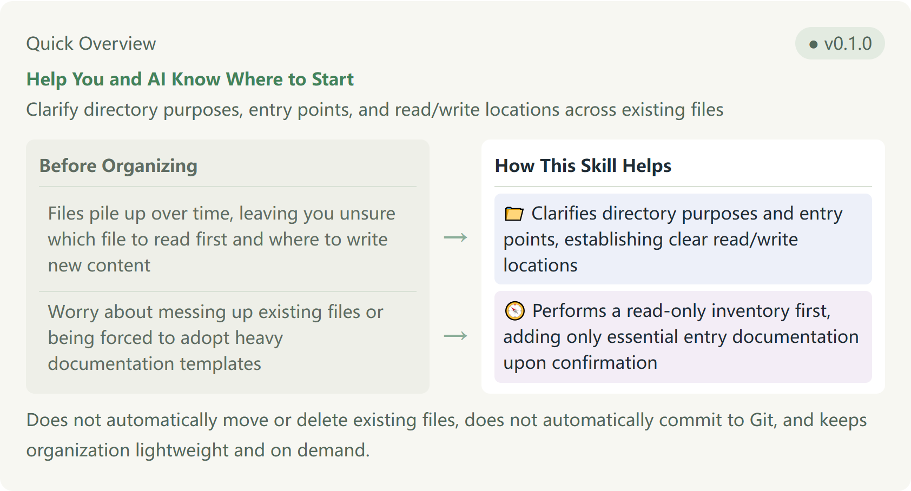

# Project Startup

[English](README.en.md) · [中文](README.md)

**Help You and AI Know Where to Start**

Clarify directory purposes, entry points, and read/write locations across existing files



- Files pile up over time, leaving you unsure which file to read first and where to write new content → 📁 Clarifies directory purposes and entry points, establishing clear read/write locations
- Worry about messing up existing files or being forced to adopt heavy documentation templates → 🧭 Performs a read-only inventory first, adding only essential entry documentation upon confirmation

Does not automatically move or delete existing files, does not automatically commit to Git, and keeps organization lightweight and on demand.

## Why This Skill Is Needed

When starting a new project, we often do not know where to put different types of files or when to start structuring the project. As scattered ideas, requirements, reference materials, and demo files accumulate over time without prior conventions, AI assistants can easily get confused about which documents to read and where to write new content.

This skill starts from existing materials, follows existing project naming conventions and rules, distinguishes active content from historical references, and clarifies directory purposes, project entry points, and key reference sources. This organization workflow leaves source materials intact while updating navigation to provide clear guidance on where to read and write. When new content is added later, users or AI can update existing descriptions only when entry points change—maintaining just the affected sections without starting over each time.

## Organization Method and Output Details

During organization, existing documentation or indexes are reused whenever possible and supplemented on demand. For empty directories, minimal entry files are created only after confirmation, avoiding heavy pre-packaged templates.

Original materials are preserved intact without rewriting historical records into new conclusions. The initial read-only inspection only reports findings and recommendations; the organization process is considered complete only after receiving authorization and verifying written entry files.

## Fictional Example

Here is a fictional scenario illustrating the actual organization workflow:

Suppose in a practice project, the root directory is cluttered with draft requirements, test scripts, and reference materials, leading AI to mistakenly reference outdated drafts when answering questions. Using Project Startup, a read-only inventory is performed first; upon confirmation, the main entry point is pointed to project documentation, clearly designating where active requirements and reference materials live. When test materials are added later, only the corresponding directory descriptions and indexes receive localized updates.

## Daily Usage

You can directly send natural language requests like:

- Use Project Startup to inventory directories and materials first—read-only, no modifications.
- Add necessary entry points and directory descriptions based on the confirmed suggestions.
- New materials were added; use Project Startup to organize only the affected descriptions.

If your assistant does not recognize the prompt, you can add $project-startup-standardization to your conversation. Different tools vary in their ability to automatically recognize skill names; if it still does not respond, you can directly provide the file path to the installed SKILL.md file.

## What Changes and What Does Not

The skill writes necessary entry points, directory descriptions, or indexes only after user confirmation. It will not automatically move, rename, or delete existing files, nor will it modify original input documents.

Organization does not automatically commit code or trigger releases. Completing organization only means clear directory entry points and record relationships have been established; it does not replace functional testing or business acceptance.

## Download and Install

To reuse this skill across multiple computers or practice projects, you can directly copy the prompt:

```text
Follow the installation guide in https://github.com/naiman-debug/naiman-skills to install Project Startup Standardization (`skills/project-startup-standardization`) in the current project. If a same-named skill already exists, stop and explain.
```

## Related Documentation

[Installation and Update Guide (Chinese)](../../docs/安装与更新.md) · [Skill Definition File](SKILL.md)
