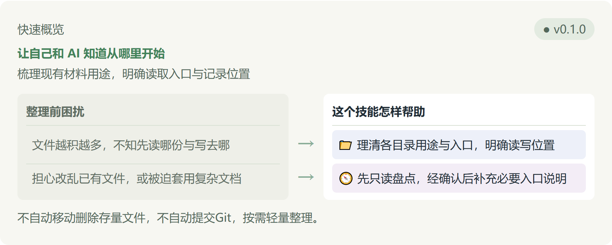

# 项目建档

[English](README.en.md) · [中文](README.md)

**让自己和 AI 知道从哪里开始**

梳理现有材料用途，明确读取入口与记录位置



- 文件越积越多，不知先读哪份与写去哪 → 📁 理清各目录用途与入口，明确读写位置
- 担心改乱已有文件，或被迫套用复杂文档 → 🧭 先只读盘点，经确认后补充必要入口说明

不自动移动删除存量文件，不自动提交Git，按需轻量整理。

## 为什么需要这个技能

刚建空目录时，我们经常不知道各类文件该往哪里放，也拿不准何时开始规划结构。随着零散的想法、需求、参考资料和演示文件陆续加入，如果事先没有约定，AI介入后就很容易分不清该读取哪份资料、又该把新内容写到哪里。

这个技能会从现有材料出发，沿用项目既有命名与规则，区分当前有效内容与历史参考，梳理出各目录用途、项目入口与重要资料来源。它不会移动或修改原始文件，而是明确指引在哪里读写。后续新增内容时，由继续工作的使用者或AI在入口变化时更新现有说明，仅维护受影响部分，无需每次推翻重来。

## 整理方式与输出说明

整理时优先复用既有说明或索引，按需补充。若是空目录，则在确认后建立最小入口，不预先套用繁复模板。

原始资料原样保留，不把旧记录改写为新结论。只读首检结束后仅报告盘点结果与建议，在获得授权并写入回读后才算完成整理。

## 虚构示例

以下为一个虚构的示意场景，展示实际整理流程：

假设在练习项目中，根目录下混杂着需求草稿、测试脚本与参考资料，提问时容易引用过时草稿。使用本技能完成只读盘点后，在确认下将主入口指向项目说明，标明有效需求与参考资料的读取位置。后续增加测试材料时，也仅对对应目录和索引做局部更新。

## 日常怎么用

你可以直接发送以下自然语言指令：

- 用项目建档先盘点目录和资料，只读不修改；
- 按刚确认的建议补齐必要入口和目录用途说明；
- 新增了资料，用项目建档只整理受影响的说明。

如果直接说中文助手没能理解，你可以在对话里加上 $project-startup-standardization；不同工具对技能名称的自动识别能力不同，如果还是没有反应，可以直接把已安装的 SKILL.md 文件路径发给它。

## 哪些会改变，哪些不会改变

技能仅在确认后写入必要的入口、目录说明或索引，不自动移动、改名或删除存量文件，也不修改原始输入。

整理不自动执行代码提交或发布，整理完成仅代表建立了清晰的目录入口与记录关系，不代替业务功能验收。

## 安装与复用

在多台电脑或练习项目中复用时，可直接复制指令：

```text
请先读取并遵循安装指南：https://github.com/naiman-debug/naiman-skills/blob/main/docs/安装与更新.md
从指南指定的 v0.1.0 源码包中，将 skills/project-startup-standardization 完整目录及许可文件安装到当前练习项目的 .agents/skills/project-startup-standardization。若遇到同名规则请先暂停确认，不复制根目录 AGENTS。安装完成后报告实际入口路径与版本号，并先做一次只读首检。
```

## English Summary

When starting a new project or gathering notes, it is often difficult for both developers and AI assistants to locate the right entry file or know where new outputs belong. This skill inspects existing materials in read-only mode, preserves original files, and establishes minimal entry points and folder descriptions upon confirmation. It distinguishes current tasks from historical references and specifies when future updates are needed. When new files are added, it updates only affected descriptions without moving existing files, ensuring safe and lightweight project organization.

## 相关文档

[安装与更新指南](../../docs/安装与更新.md) · [技能定义文件](SKILL.md)
